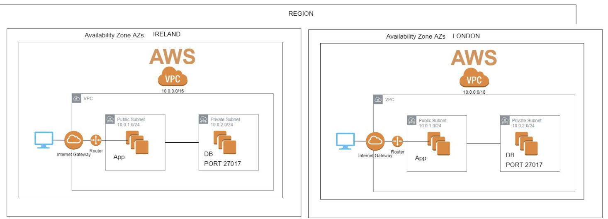

# Cloud Computing
## Amazon Web Services (AWS)
### AWS Global Infrastructure
#### AWS Regions
#### AWS Availability Zones (AZs)
#### Advantages of Cloud Computing and AWS

### Public Cloud - Pivate Cloud and Hybrid Cloud use cases
- Iaas - PaaS - SaaS examples?
- Cloud Data Centers


## AWS Services
- Elasic Compute Service `EC2`
  
- Simple Storage Service `S3`
- Virtual Private Network `VPC`
- Internet Gateway `IG`
- Route Tables `RT`
- Subnets `sn`
- Network Access Control `NALs`
- Security Groups `SG`
- Cloudwatch `CW`
- Simple Notification Service `SNS`
- Simple Queue Service `SQS`
- Load Balancers `LB` - `ALB` - `ELB` - `NLB`
- Autoscaling Groups `ASG`
- Amazon Machine Image `AMI`
- Dynamodb - Mongodb
  
  # Launch ec2 instance

- ssh debugging
```
eval ssh-agent

ssh-add "keyfile.pem"
```
- update and upgrade system
- install nginx
- nginx enabled
- check the public globally
  
- install node correct version
- install required dependencies
- `app code` currently available on `localhost`
- task: `find out how to migrate/transfer/copy data from on prem to cloud`
  
- npm install 
- npm start

- share your public ip with port 3000 displaying node home page
- second iteration set up the reverse proxy so we could load node page on the public ip with out port 3000

### AWS Global Infrastructure
- AWS Region and Availability Zones
  


- 2Tier Achitecture Deployment
.png)


### Monitoring
.png)

